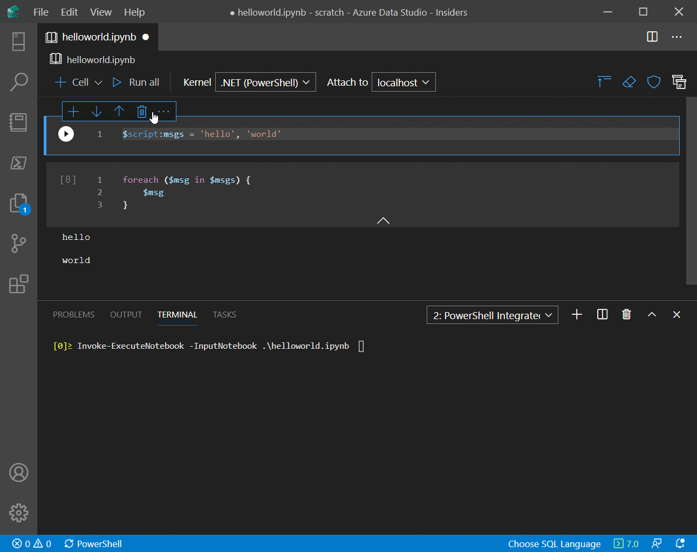
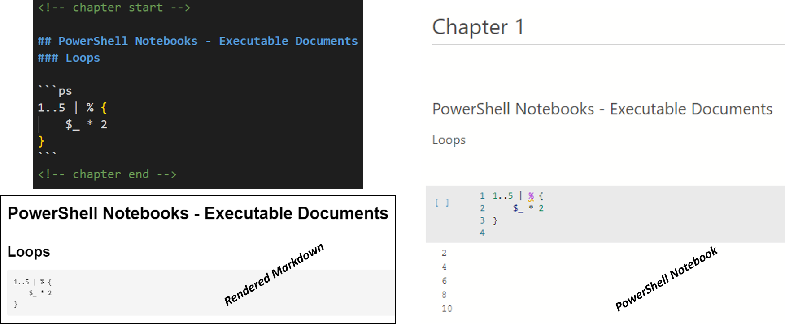
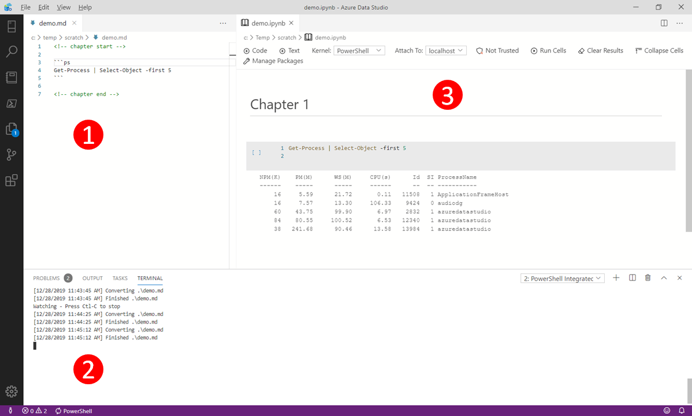
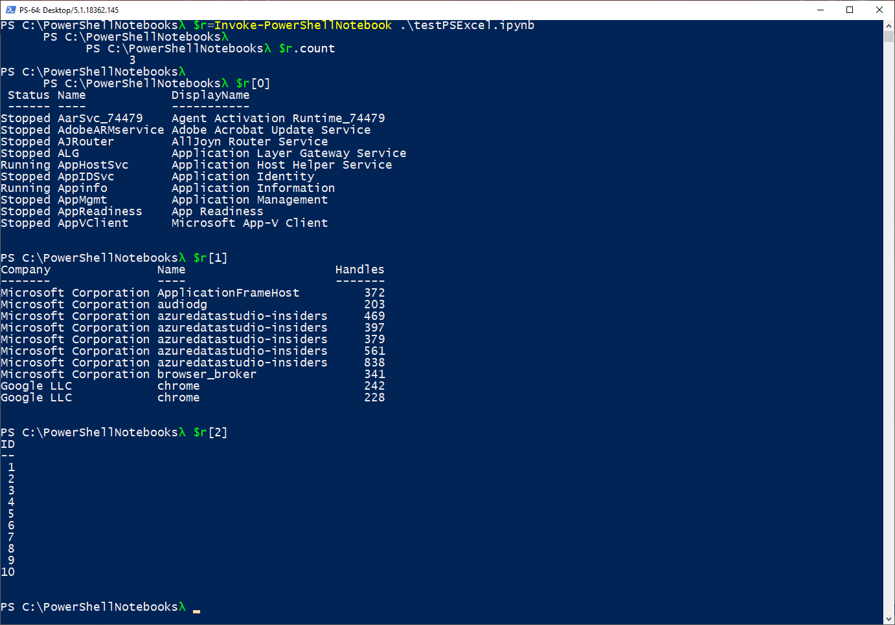
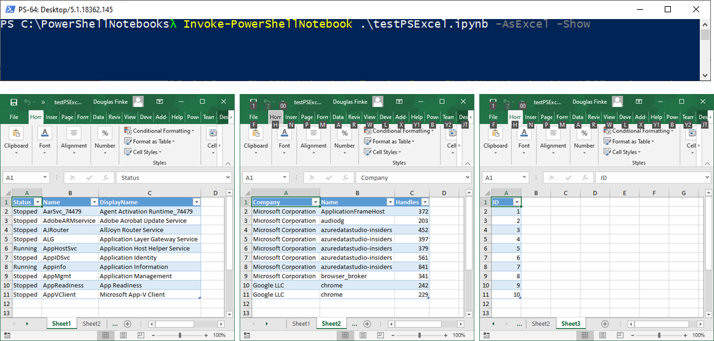
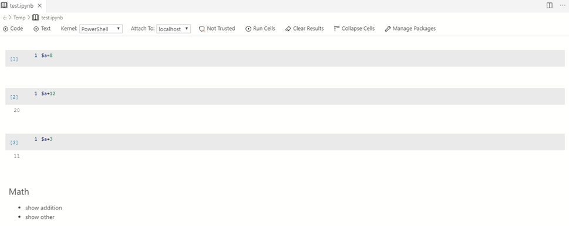
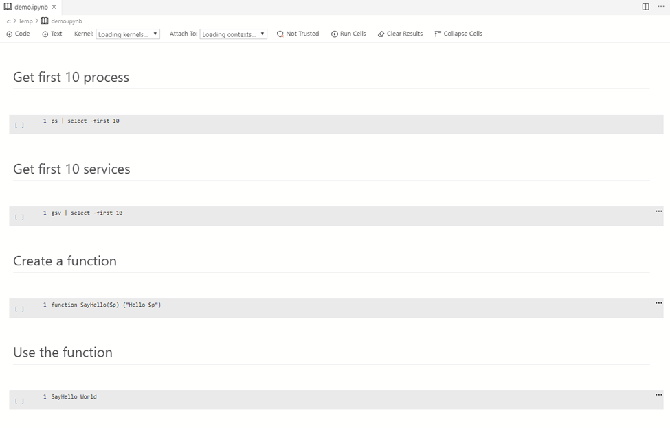

# PowerShell Notebook

This module includes the function `Invoke-PowerShellNotebook` which enables you to run the *cells* inside the PowerShell notebook.

## Continuous Integration Status
</br>


|Environment||
|---|---|
| Windows | [](https://dougfinke.visualstudio.com/PowerShellNotebook/_build/latest?definitionId=22&branchName=master)
| Windows (Core)  | [](https://dougfinke.visualstudio.com/PowerShellNotebook/_build/latest?definitionId=22&branchName=master)
| Ubuntu | [](https://dougfinke.visualstudio.com/PowerShellNotebook/_build/latest?definitionId=22&branchName=master)
| macOS | [](https://dougfinke.visualstudio.com/PowerShellNotebook/_build/latest?definitionId=22&branchName=master)

</br></br>

# Parameterizing a PowerShell Notebook

To parameterize your notebook designate a cell with the tag `parameters`. This is easy using `Azure Data Studio`.



`Invoke-ExecuteNotebook` looks for the parameters cell and treats this cell as defaults for the parameters passed in at execution time. `Invoke-ExecuteNotebook` will add a new cell tagged with injected-parameters with input parameters in order to overwrite the values in parameters. If no cell is tagged with parameters the injected cell will be inserted at the top of the notebook.

## Executing a Notebook

You can execute the notebook in either a PowerShell script or at the command line.

```powershell
Import-Module PowerShellNotebook

Invoke-ExecuteNotebook `
    -InputNotebook 'path/to/input.ipynb' `
    -OutputNotebook 'path/to/output.ipynb' `
    -Parameters @{ alpha=0.6; ratio=0.1 }
```
### Execute via CLI

This executes the `.\input.ipynb` and outputs the results to the console.

```powershell
Invoke-ExecuteNotebook .\input.ipynb
```

```
alpha = 1.2, ratio = 3.7, and alpha * ratio = 4.44

a = 5 and twice = 10
```

This executes the `.\input.ipynb`, injects the parameters, and outputs the results to the console.

```powershell
Invoke-ExecuteNotebook .\input.ipynb -Parameters @{ alpha=0.6; ratio=0.1; a=10}
```

```
alpha = 0.6, ratio = 0.1, and alpha * ratio = 0.06

a = 10 and twice = 20
```

### Save to a new notebook

You can execute the notebook and save it to a new notebook either locally, or as a a GitHub gist.

_Note_: You'll need to get a GitHub Public Access Token (PAT) and set `$env:GITHUB_TOKEN` to it.

```powershell
Invoke-ExecuteNotebook .\input.ipynb gist://input_run1.ipynb -Parameters @{ alpha=0.6; ratio=0.1 }
```

# More

Short video on [Invoke-ExecuteNotebook](https://youtu.be/3VE27vLtlJY?t=316)

One of the uses of this Powershell tool  is for parameterizing, and executing Jupyter Notebooks, `Invoke-ExecuteNotebook`. This opens up new opportunities for how notebooks can be used. For example you may have a financial report that you want to run with different values on the first or last day of a month using parameters makes this task easier.

# Check out the [Video Here](http://bit.ly/2SylBm4)

In a nutshell.

1. Author your markdown with `Chapter Start and End`, then use fence blocks ``` to indic
1. In [Azure Data Studio](aka.ms/GetAzureDataStudio) PowerShell console, run `Convert-MarkdownToNoteBook .\demo.md -watch`
    - When you save the file, `Convert-MarkdownToNoteBook` detects and auto converts it to a `PowerShell Notebook`
1. The converted Interactive PowerShell Notebook. *Note*: `Convert-MarkdownToNoteBook` also runs the code from the markdown file and includes the results.
1.  Thanks to [Aaron Nelson](https://twitter.com/SQLvariant) and friends. Easily turn your SQL scripts into an interactive Jupyter Notebook with `ConvertTo-SqlNoteBook`. Plus, you can go the other way and turn an interactive Jupyter Notebook that has SQL in it, to a pure SQL script with `Export-NotebookToSqlScript`. 

# Convert a Markdown File to a PowerShell Notebook

`Convert-MarkdownToNoteBook` converts your markdown, recognizes `fenced code blocks` and converts it, and "runs" the PowerShell, including that snippets results in an *executable document*, a PowerShell notebook.

- Share it with colleagues to better illustrate concepts
- Develop workflows other can use, for diagnostics, testing, and more

```powershell
Convert-MarkdownToNoteBook .\multiplePSLines.md
```



### Exclude Results

Sometimes you don't the results to be included in the converted PowerShell Notebook.

You can suppress evaluating the PowerShell code being run and the results being included by have the following comment as the first line in the fence block.

`# Exclude Results`

```
    ```ps
    # Exclude Results
    1+1
    ```
```

This will include the `1+1` in the interactive notebook, but will **not** evaluate the PowerShell statement and include it.



# Available Functions

| Function | Synopsis
|---|---|
|Add-NotebookCode|Add-NotebookCode adds PowerShell code to a code block
|Add-NotebookMarkdown|Add-NotebookMarkdown adds Markdown to a markdown block
|Add-NotebookMarkdown|Add-NotebookMarkdown is intended to be used in a New-PSNotebook scriptblock
|ConvertFrom-NotebookToMarkdown|Take and exiting PowerShell Notebook and convert it to markdown|
|Convert-MarkdownToNoteBook|Convert a markdown file to an interactive PowerShell Notebook|
|ConvertTo-SqlNoteBook|Converts a .SQL file to a Notebook file|
|Export-NotebookToPowerShellScript|Exports all code blocks from a PowerShell Notebook to a PowerShell script
|Export-NotebookToSqlScript|Exports all text & code blocks from a SQL Notebook to a .SQL file|
|Get-Notebook|Get-Notebook reads the metadata of a single (or folder of) Jupyter Notebooks
|Get-NotebookContent|Get-NotebookContents reads the contents of a Jupyter Notebooks
|Invoke-PowerShellNotebook|Invoke-PowerShellNotebook executes all the PowerShell code blocks in a PowerShell Notebook.
|New-PSNotebook|Creates a new PowerShell Notebook that can be returned as text or saves as a `ipynb` file.
|New-PSNotebookRunspace|New-PSNotebookRunspace instantiates the PSNotebookRunspace
|New-SqlNotebook|Creates a new SQL Notebook that is saved as an `.ipynb` file|


# A PowerShell Notebook with Cells

Below is a PowerShell Notebook with three cells, each containing a PowerShell "script".


Notice the second cell has the results of running `get-process | select company, name, handles -first 10`

# Automate the PowerShell Notebook



# Bonus Points: Using the `-AsExcel` switch

`Invoke-PowerShellNotebook` sports an `AsExcel` switch. This lets you execute each cell in the PowerShell notebook and the function exports the results to a separate sheet in an Excel file.



You need to have the PowerShell `ImportExcel` module installed. The module is on the PowerShell Gallery, use `Install-Module ImportExcel` to install it on you machine.

# A Little Language to Create PowerShell Notebooks
## PowerShell Little Language

### Create and Save a PowerShell Notebook

You can also create PowerShell Notebooks outside if Azure Data Studio with this module. Here is an example.
It creates two code blocks and a markdown block, and saves it to a file `C:\Temp\test.ipnyb`.

```powershell
New-PSNotebook -NoteBookName c:\temp\test.ipynb {
            Add-NotebookCode '$a=8'
            Add-NotebookCode '$a+12'
            Add-NotebookCode '$a+3'
            Add-NotebookMarkdown @'
## Math

- show addition
- show other
'@
}

```

### Open the PowerShell Notebook in Azure Data Studio

You can open `c:\temp\test.ipynb` in Azure Data Studio and click `Run Cells`



### Convert a *demo.txt* file to a PowerShell Notebook

If you've used `start-demo.ps1` to setup PowerShell demos, this function will convert that format into a PowerShell Notebook.

```powershell
ConvertTo-PowerShellNoteBook .\demo.txt .\demo.ipynb
```

Converts this to a PowerShell Notebook.

```text
# Get first 10 process
ps | select -first 10

# Get first 10 services
gsv | select -first 10

# Create a function
function SayHello($p) {"Hello $p"}

# Use the function
SayHello World
```

#### Here it is in Azure Data Studio



# SQL Notebooks

This module includes three functions for converting or creating SQL Notebooks which are compliant with the format used in Azure Data Studio.

For file conversion scenarios the `ConvertTo-SqlNoteBook` & `Export-NotebookToSqlScript` commands are available.

1. `ConvertTo-SqlNoteBook` Will convert a .SQL file to a Notebook file (.ipynb)
2. `Export-NotebookToSqlScript` Will export all text & code blocks from a SQL Notebook to a .SQL file
3. The `New-SqlNotebook` Can creates a new SQL Notebook, and content can be added to that new SQL Notebook using the `Add-NotebookMarkdown` & `Add-NotebookCode` commands

## Examples

The example below downloads the latest version of the BPCheck Jupyter Notebook from the TigerToolbox repository, converts it into a .SQL file (named BPCheck.SQL), and gets the content.

```powershell
Export-NotebookToSqlScript "https://raw.githubusercontent.com/microsoft/tigertoolbox/master/BPCheck/BPCheck.ipynb"
Get-Content .\BPCheck.sql
```

The example below converts the `AdventureWorksMultiStatementSBatch.sql` file into a SQL Notebook.

```powershell
ConvertTo-SQLNoteBook -InputFileName 'C:\temp\AdventureWorksMultiStatementSBatch.sql' -OutputNotebookName 'C:\temp\AdventureWorksMultiStatementSBatch.ipynb'
```